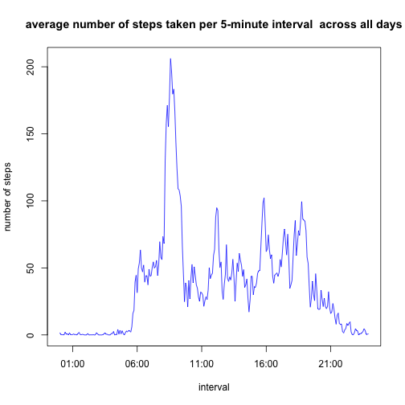
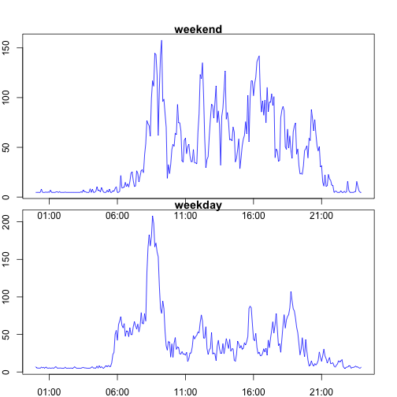

A.Loading and preprocessing the data

```r
data<-read.csv("./activity.csv")
hours<-data$interval%/%100
mins<-data$interval-hours*100
hours<-as.character(hours)
mins<-as.character(mins)
data$date<-as.POSIXct(data$date)
data$interval<-as.POSIXct(paste(hours,mins,sep = ":"),format=" %H:%M") 
```

B.What is mean total number of steps taken per day?


1.Make a histogram of the total number of steps taken each day

```r
totalsteps<-aggregate(steps~date,data,sum)
hist(totalsteps$steps,breaks=10,main="histogram of the total number of steps taken each day",xlab="the total number of steps taken per day")
```

 


2.Calculate and report the mean and median total number of steps taken per day

```r
mean(totalsteps$steps)
```

```
## [1] 10766.19
```

```r
median(totalsteps$steps)
```

```
## [1] 10765
```


C.What is the average daily activity pattern?

1.Make a time series plot (i.e. type = "l") of the 5-minute interval (x-axis) and the average number of steps taken, averaged across all days (y-axis)

```r
meansteps<-aggregate(steps~interval,data=data,FUN=mean)
plot(meansteps$interval,meansteps$steps,type="l",col="blue",main="average number of steps taken per 5-minute interval  across all days",xlab="interval",ylab="number of steps")
```

 


2.Which 5-minute interval, on average across all the days in the dataset, contains the maximum number of steps?

```r
subset(meansteps,steps>200)
```

```
##                interval    steps
## 104 2015-01-14 08:35:00 206.1698
```
With the images in question 1, we can get that the interval contains the maximun number of steps is "08:35"


D.Imputing missing values

1.Calculate and report the total number of missing values in the dataset 

```r
missing<-subset(data,is.na(steps) ==TRUE)
nrow(missing)
```

```
## [1] 2304
```
Total number of missing values in the dataset is 2304

2.Devise a strategy for filling in all of the missing values in the dataset.

The strategy I choose:  "mean of this interval over all days". I will make the mean total number of steps taken per day(from B.2) evenly distributed over the day (288 intervals)

3.Create a new dataset that is equal to the original dataset but with the missing data filled in.

```r
newdata<-data
value<-mean(totalsteps$steps)/288
for (i in 1:17568){
    if (is.na(newdata$steps[i])){
       newdata$steps[i]<-value
    }
}
```


4.Make a histogram of the total number of steps taken each day and Calculate and report the mean and median total number of steps taken per day. Do these values differ from the estimates from the first part of the assignment? What is the impact of imputing missing data on the estimates of the total daily number of steps?

```r
newtotalsteps<-aggregate(steps~date,newdata,sum)
hist(newtotalsteps$steps,breaks=10,main="new histogram of the total number of steps taken each day",xlab="the total number of steps taken per day")
```

 

```r
mean(newtotalsteps$steps)
```

```
## [1] 10766.19
```

```r
median(newtotalsteps$steps)
```

```
## [1] 10766.19
```
The mean is same as before, the median is a little bigger.

E.Are there differences in activity patterns between weekdays and weekends?

1.Create a new factor variable in the dataset with two levels "weekday" and "weekend" indicating whether a given date is a weekday or weekend day.

```r
for (i in 1:17568){
    if (weekdays(newdata$date[i])=="Saturday"){
        newdata$week[i]<-"weekend"
    }
    else if (weekdays(newdata$date[i])=="Sunday"){
        newdata$week[i]<-"weekend"
    }
    else{
        newdata$week[i]<-"weekday"
    }
}
```

2.Make a panel plot containing a time series plot (i.e. type = "l") of the 5-minute interval (x-axis) and the average number of steps taken, averaged across all weekday days or weekend days (y-axis).

```r
weekday<-subset(newdata,week=="weekday")
weekend<-subset(newdata,week=="weekend")
weekdaymean<-aggregate(steps~interval,data=weekday,FUN=mean)
weekendmean<-aggregate(steps~interval,data=weekend,FUN=mean)
weekdaymean$week<-"weekday"
weekendmean$week<-"weekend"
par(mfrow=c(2,1),mar=c(0,0,1,0),oma=c(2,2,2,2))
with(weekendmean,plot(interval,steps,type="l",col="blue",main="weekend",ylab="number of steps "))
with(weekdaymean,plot(interval,steps,type="l",col="blue",main="weekday",xlab="interval"))
```

 

